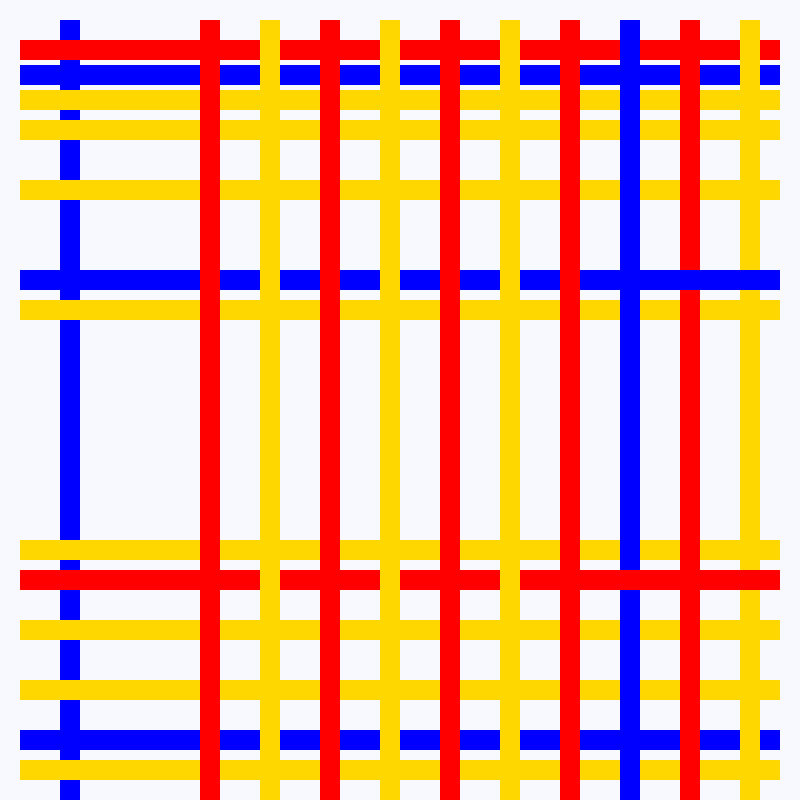

[Back](../../)
# Creative
Just draw something. I draw picture similare to
[that](https://upload.wikimedia.org/wikipedia/commons/thumb/c/cf/Piet_Mondriaan%2C_1942_-_New_York_City_I.jpg/800px-Piet_Mondriaan%2C_1942_-_New_York_City_I.jpg)
[Piet Mondrian](https://de.wikipedia.org/wiki/Piet_Mondrian)
picture.

## Output
Output picture is converted from a bitmap (ppm file) to a jpg. (To easily upload it to github.)

