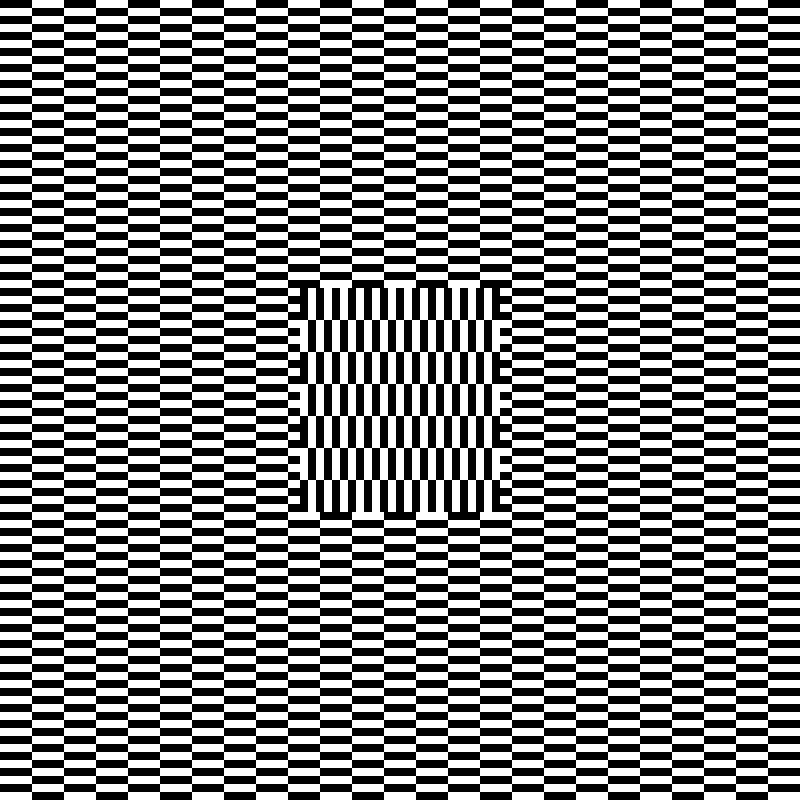
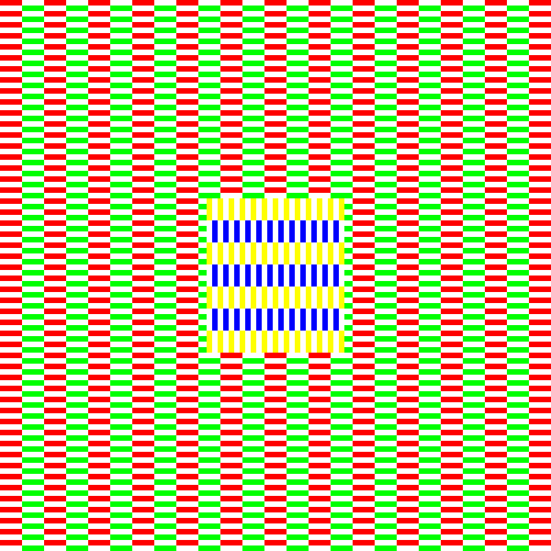
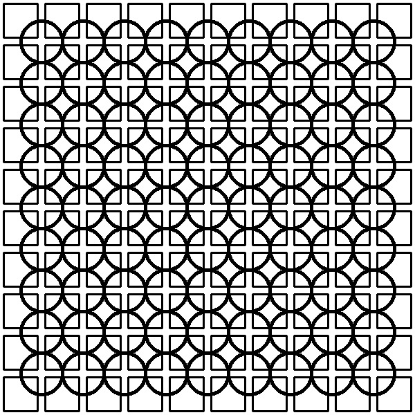
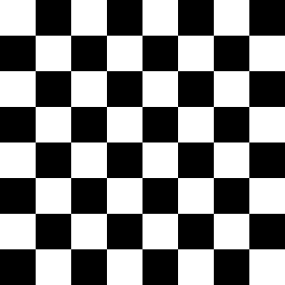
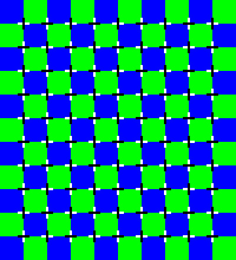

[Back](../../)
# Illusions
Draw given illusions.
All my output pictures are converted from bbp (bitmap) to jpg. (to easily upload it to github)

# Ouchi
## Output

## Alternative Coloring

# Concentric
## Output

# Squarecircle
## Output

# Checkerboard
## Chessboard

## Output

