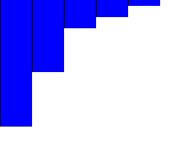

[Back](../../)
# Sorting
Implement a recursive sorting algorithm. The program gets an array like
```
(1, 4, 8, 2, 3, 7)
```
And should sort them ascending (high to low), so the output should look like this
```
(8, 7, 4, 3, 2, 1)
```
Finally it visuallizes this output by drawing a bar diagramm of the final sorted array.
## Quicksort
Recursive quicksort implementation using helper methods: Swap and Parition.
### Swap
A swap method that swaps two elements in given array.
### Parition
Given the low, high and pivot element. Low meaning the start point of the array that should get sorted and
high meaning the end element. So all elements in the sub array from array[low to high] get rearraged with the help of the pivot element. All elements in that range that are less than the pivotelement go to the left side and all that are bigger than the pivot element go to the right side.
Example:
```
[3,9,7,2,10,18,1, Pivot=19, 20, 21, 25, 22, 78, 90]
```
### Quicksort
Using the pseudocode from [wikipedia](https://de.wikipedia.org/wiki/Quicksort)
```
 funktion quicksort(links, rechts)
     falls links < rechts dann
         teiler:= teile(links, rechts)
         quicksort(links, teiler - 1)
         quicksort(teiler + 1, rechts)
     ende
 ende
```
The final implementation using VHDL
```
  procedure quicksort(data : inout int_arr_t; left : integer; right : integer) is
    variable pivot : integer;
  begin
    if left < right then
        partition(data, left, right, pivot);
        quicksort(data, left, pivot - 1);
        quicksort(data, pivot + 1, right);
    end if;
  end procedure;
```

# Draw Bars
The draw bars procedure gets the sorted array. So we already know the highest and lowest values. Values below 0 are drawn in blue color and values above 0 are drawn in red color. The output drawings also get an index. So the output files are named:
```
variable output_number : natural := 0; -- for naming exported drawing files
```
```
sored0.ppm, sorted1.ppm, sorted2.ppm ... sorted[output_number].ppm
```
## Testcases
### Positive values
#### Input
```
int_arr_t(-10 downto -19) := (10, 9, 8, 7, 6, 5, 4, 3, 2, 1);
```
#### Output

### Mixed Values
#### Input
```
int_arr_t(-5 to 5) := (-12, 45, 78, -23, 56, 89, 34, 67, 91, -15, -42);
```
#### Output

### Negative values
#### Input
```
int_arr_t(5 downto 0) := (-10, -11, -12, -13, -17, -22);
```
#### Output

