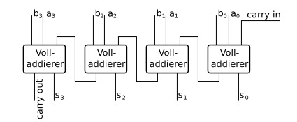

# Structural 4-Adder
Write a 4 bit adder with the structural design style. So using the bottom up implementation approach of creating smaller components. Test smaller components and connect more instances of smaller components. Repeat the steps of creating and testing until the final design is done.
## Top Down Design:
The design part is already done.
- Goal is a 4Bit Ripple Carry Adder -> needs FA
- FA needs HA, Or-Gate
- HA needs Xor-Gate, And-Gate
- Or-Gate, And-Gate, Xor-Gate using concurrent design style
## Exercise Implementation: Bottom up
### Structural Design Style in VHDL
Bottom up implementation. In this exercise the design part is already done, so only the implementation is left to do. This is best done by starting with the smallest component block and then working towards the final design. Starting to build the smallest units Simple Logic Gates: and, xor and or gate. Then bye using the and-gate and or-gate the half adder can be implemented. With two half adder components and an or-gate the fulladder can be implemented. Every step useds the structural design style (note that this is by purpose of this exercise, but the implementation of the components can also be done with the concurrent design style or with the sequential design style) This leads to the final top component the 4 bit adder. This component uses 4 fulladder components.
```
instance_label: component_name
    port map (
        port1 => signal1,
        port2 => signal2,
        ...
    );
```
### Basic Gates: AND, XOR, OR
Nothing special can be seen here, just the basic gates, for more informations the wikipedia pages.
[and](https://de.wikipedia.org/wiki/Und-Gatter)
[xor](https://de.wikipedia.org/wiki/Exklusiv-Oder-Gatter)
[or](https://de.wikipedia.org/wiki/Oder-Gatter) <br>
```
z <= a and b;
```
```
z <= a xor b;
```
```
z <= a or b;
```
Can be implemented using concurrent design style each with that one liner:
### Halfadder using XOR and AND Gate (HA)
[Halfadder](https://de.wikipedia.org/wiki/Halbaddierer) wikipedia page for the halfadder. There is also the implementation that I use with the and-gate for carr output, xor gate for the sum. <br>
### Fulladder using two Halfadders and one OR Gate (FA)
[Fulladder](https://de.wikipedia.org/wiki/Volladdierer) wikipedia page for the halfadder. There is also the implementation that I use with the and-gate for carr output, xor gate for the sum.
Wikipedia page for the fulladder. There is also the implementation that I use with two ha and one or gate. <br>
### 4 Bit Adder using 4 FA
[4BitAdder](https://de.wikipedia.org/wiki/Carry-Ripple-Addierer)
the same for the final component. In this wikipedia article there can also be a implementation found using 4 FA. <br>

