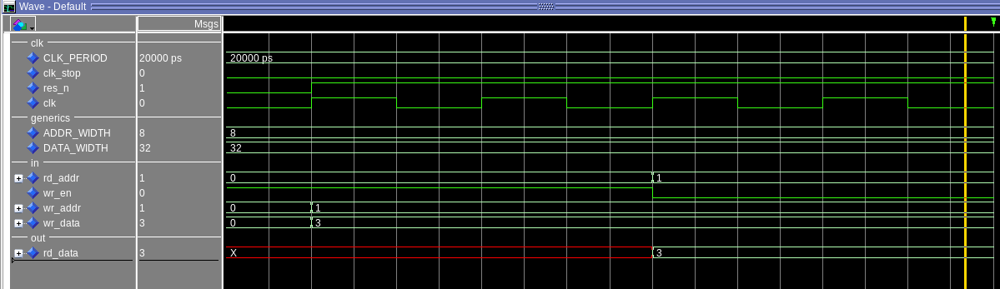
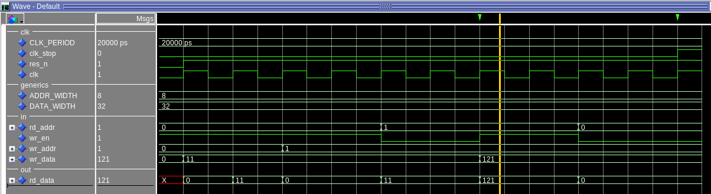
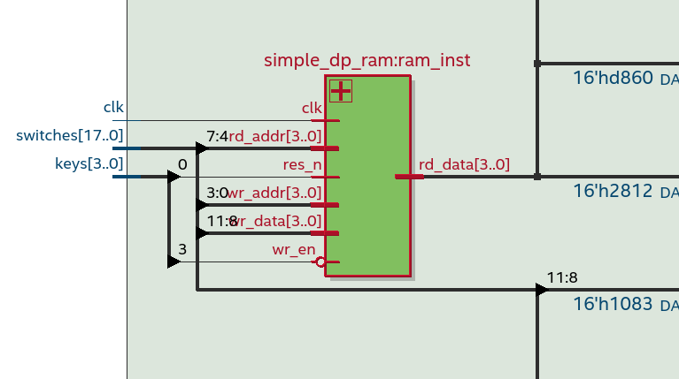
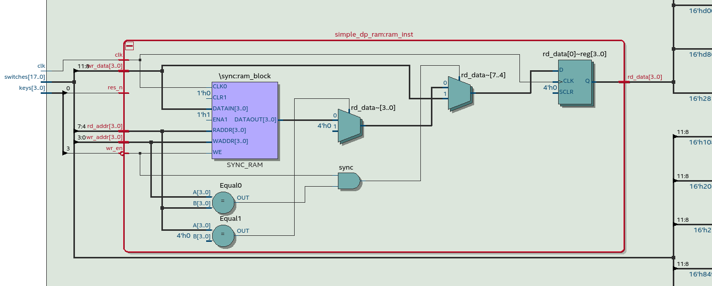
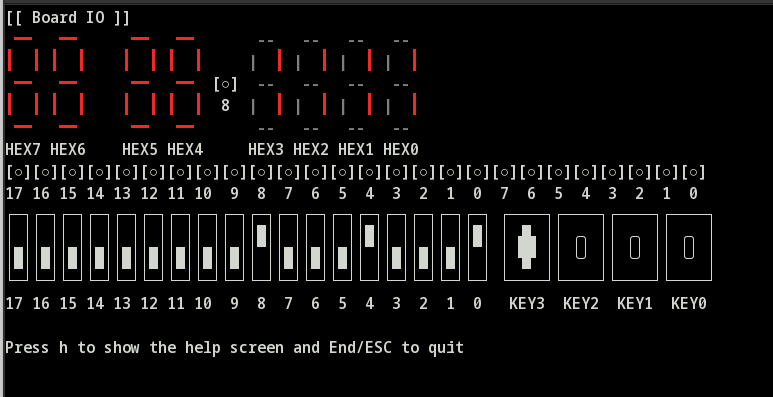
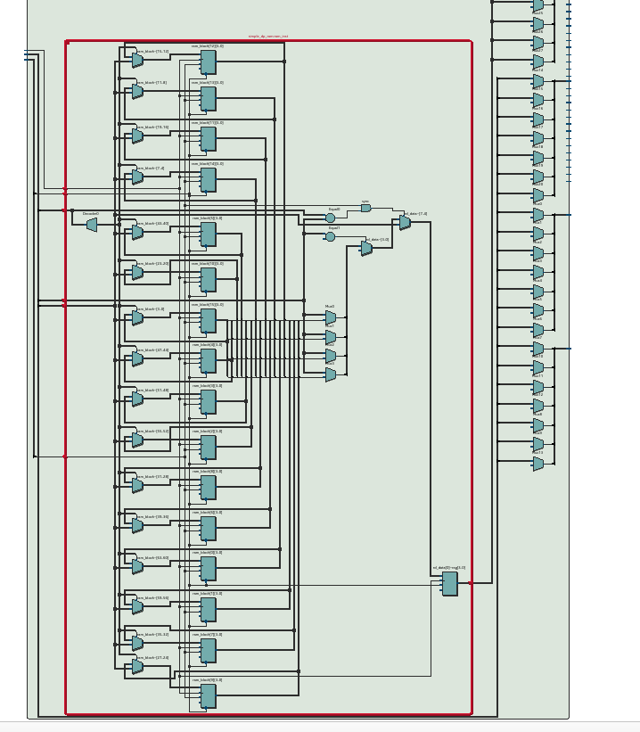
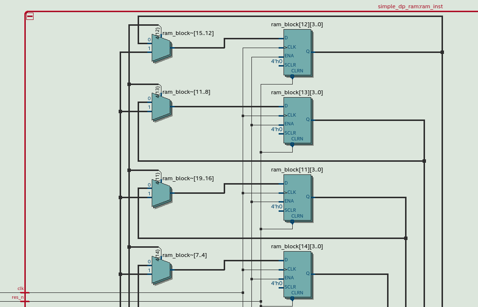

[Back](../../)
# Blockram
Implementing a "single-clock synchronous RAM with new data read-during-write behavior" using this guide [Quartus User Guide](https://www.intel.com/content/dam/www/programmable/us/en/pdfs/literature/ug/ug-qpp-design-recommendations.pdf)
<br> <br>
Code from the Guide
```
LIBRARY ieee;
USE ieee.std_logic_1164.all;

ENTITY single_clock_ram IS
  PORT (
    clock: IN STD_LOGIC;
    data: IN STD_LOGIC_VECTOR (2 DOWNTO 0);
    write_address: IN INTEGER RANGE 0 to 31;
    read_address: IN INTEGER RANGE 0 to 31;
    we: IN STD_LOGIC;
    q: OUT STD_LOGIC_VECTOR (2 DOWNTO 0)
  );
END single_clock_ram;

ARCHITECTURE rtl OF single_clock_ram IS
  TYPE MEM IS ARRAY(0 TO 31) OF STD_LOGIC_VECTOR(2 DOWNTO 0);
BEGIN
  PROCESS (clock)
    VARIABLE ram_block: MEM;
  BEGIN
    IF (rising_edge(clock)) THEN
      IF (we = '1') THEN
        ram_block(write_address) := data;
      END IF;
      q <= ram_block(read_address);
      -- VHDL semantics imply that q doesn't get data
      -- in this clock cycle
    END IF;
  END PROCESS;
END rtl;
```
The goal is to modify code so that the program creates/synthesises a ram that:
- Implements a ram with the given addr_width and data_width generics
- Read from addr 0 always outputs 0
- Write-Through behavior, when wr_en = '1' and (wr_addr = rd_addr) then rd_data outputs wr_data immediately (in the same cc)


## Implementation and Simulation
Write boilerplate code for the tb (uut, basic stimulus, clk_gen) and sync process. Then insert the template code from the intel quartus website.

<br>
Add read 0 behavior, so that reading from addres 0 always outptus 0
<br>

<br>
Add Write-Through behavior:
<br>

<br>
### Simulation using File I/O
The testbench also reads the debugdata_in.txt and writes the provided data to the ram. The format is ADDRESS: DATA
```
[edauser@vbox blockram]$ cat tb/debugdata_in.txt
88: 01100100
78: 00100000
17: 00100000
... and so on ...
52: 00101110
75: 00100000
15: 01110100
```
Then it reads all the valid addresses from the ram and write it to the file debugdata_out.txt
```
[edauser@vbox blockram]$ cat tb/debugdata_out.txt
1: 01010100
2: 01101000
3: 01100101
... and so on ...
184: 01101110
185: 01110100
186: 00100001
```
There can also be a secret message found by interpreting the data as ASCII characters.

## Test on the fpga Board
After the simulation is done, it is time to test the design on the fpga board.
### Init and connect the blockram with (no reset, res_n signal no in use)
First layer of the design in the rtl view.
<br>

<br>
Here now can be seen that quartus uses the right ram blocks of the fpga board "syncram_block"
<br>

<br>
Now loading the design on the fpga board and testing it. Here the write-through behavior is shown.
```
  --inputs
  readaddr <= switches(3 downto 0);
  writeaddr <= switches(7 downto 4);
  wrdata <= switches(11 downto 8);

  --display inputs
  hex0 <= to_segs(readaddr);
  hex1 <= to_segs(writeaddr);
  hex2 <= to_segs(wrdata);

  --display output
  hex3 <= to_segs(rddata);
```
Key0 is res_n (does nothing in that implementation) and Key3 is wr_en


<br>

### Implment a second blockram with reset function
Now to see if something changes in the synthesis in quartus the blockram is implemented using the res_n.
<br>

<br>
Now the design is not using the on board ram but instead must make the memory by using ff elements. This can lead to problems in designs because there is a limit on resources on the fpga board and all resources should be used as efficiently as possible. So this is why the quartus user guide does not implement the ram with a reset functionlality.
<br>

<br>
