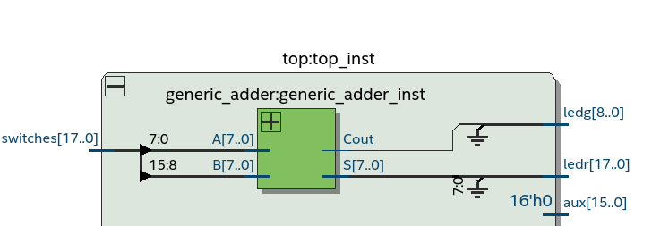
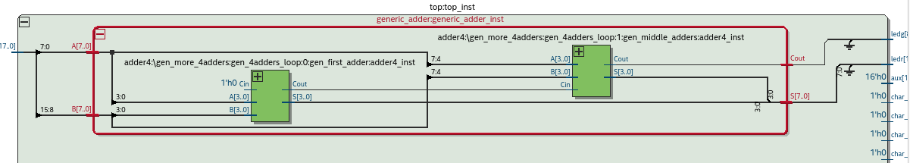

# Generic Adder
Use the 4Bit-Adders from chapter1 to generate an N-Bit Adder by chaining 4Bit adders together. The Input N is used to set the N-Bit Width for the Adders.
The design only uses 4Bit-Adders so only multiples of 4Bit are valid. (so 4Bit, 8Bit, 12Bit, ..., 32Bit, ..., 64Bit, ....)  
## Important note:
Instead of starting with the final design I tried to make the process easier or less error prone Aby implementing easier versions of the final design. Then simulate and test that prototypes and move on until the final design was done.
## Implementation/Simulation/Testing
- First I use a much easier problem by fixing the input N to 4. This is equal to just one 4Bit Adder. Then simulate and test it on the FPGA Board. This worked fine and gave me the boilerplate for the next steps.
- Then I just used the input N=8 so just the first and last 4Bit Adders when N>8. Then repeat simulate and testing on the FPGA Board steps.
- The last step is to use the next greater number for N so N=12 this allowed me to implement the adder between the first and last 4Bit Adder.
## Simulation with Modelsim/GHDL
### Exhaustive-Testcase like in the Adder4 example
Using my testcase from the 4Bit Adder exercise from chapter1 and modify it a little bit. Worked fine at the first run, so assume no bugs.
### Fibonacci-Testcase
#### Bug1 error in implementation
Loop error in the implementation caused wrong generation, that error could not be spot by the previous testcase. Because the N=8. So the error was in
the 4Adders between the first and last iteration.
#### Bug2 using integers
This caused that the overflow bit got never triggered because integers are to small. So I solved it by using the unsigned datatype instead.
## Final Test on the FPGA Board
### Generic adder in the rtl viewer in quartus.

### Generic Adder build by 4Bit adders (N=8 so 2*4BitAdder)

