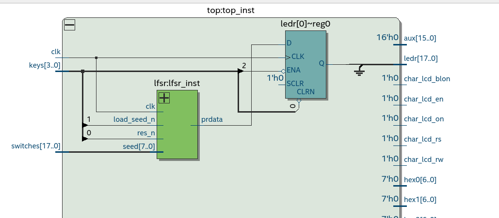

[Back](../../)
# Linear Feedback Shift Register (LFSR)
Implementing a LFSR. With a generic width and a polynomial for the feedback loop.
```
lfsr_width := 4;
--meaning internal shift reg is from: (lfsr_width-1 downto 0) so 3 downto 0
```

```
polynomial := "1100";
-- meaning feedback of the first  x(0) <= (x(3) xor x(2))
```
There can also be a seed inserted using the load_seed_n and seed inputs.
The seed is the init values of the shift register. The shift register outputs the data
in a seriell output named prdata. (pr=pseudo random) Because lfsr are used to create pseudorandom data.
## Implementation and Simulation
Write boilerplate code for the tb (uut, basic stimulus, clk_gen) and sync process. I used the demo2 lfsr as starting point. So I knew the right pattern for testing already.
Then I just tried to set the seed and check if that works.

<br>
After that create the internal shift register for a range input so using loops.
<br>

<br>
To capture the whole output of the serial output prdata, the outputdata is loaded into a shift register.
So I created a shift-regsiter in the tb and connected the input of the register to the prdata.
<br>

<br>
After that I created a counter in the tb to count the cc to get the period. The period is when the
values in the output shift register is the same as the seed so the init value again. I got the period by
just waiting for the output shift register to get the same as the init and then start my counter until
it is again the same value. To better understand that just the code:
```
--wait to see the start value again then start counting until the register got the start value again
wait until to_unsigned(seed_val, LFSR_WIDTH) = unsigned(shift_reg);
start_count <= '1';
wait until to_unsigned(seed_val, LFSR_WIDTH) = unsigned(shift_reg);
start_count <= '0';

report "seed: " & to_string(seed_val) & ", " & "period: " & to_string(to_integer(counter));
```
<br>
Now I tested with the poly inputs to see if the period is correct. The design did not yield the corect period and ofen did not even terminate. So there must be a bug. To spot the bug I just used the simple demo2 implementation because I can easy check that outputs with my eyes. This report statement yields some errors so I looked into it and it had to be an bug in the feedback logic. The bug was that I did not reset the feedback variable to '0'. So sometimes it got values like '0' xor '0' as '1' and '0' xor '1' as '0' and so on... So that the program from time to time terminated was just pure luck.

```
report to_string(x(3)) & " xor " & to_string(x(2)) & " is " & to_string(feedback);
```

After that I used assertion to quickly check if the bug was fixed:

```
assert (x(2) xor x(3)) = feedback report "ERROR in feedback logic";
```

Finally the last check was with the POLY 8 logic. So i check it again manually with the assertion:

```
assert (x(7) xor x(5) xor x(2)) = feedback report "ERROR in feedback logic";
--POLY_8 "10100100"; meaning x(7) xor x(5) xor x(2)
```

After that also run with no errors, I continued with the testing of all testcases. The output of the
testcases can be found in `./out/*.txt`.


## Test on the fpga Board
After the simulation is done with no spottet bugs anymore, it is time to test my design on the fpga board. I checked the design with the rtl viewer to see if my assumptions are right. Quartus yields latches caused by feedback loops, but I assumed that is correct because this design uses feedback loops intentionaly. (I was wrong)
The first is just the overview and the led output can be seen saved in a reg.
<br>

<br>
So here is the design before I found the second error:
<br>

<br>
I did reset the registers but not to '0' but to the seed value. This caused quartus the need to save that values. So after fixing that the design looks much cleaner:
<br>

<br>
After that make qdownload_remote and testing on the fpga board using remote.py -i. The led saves the last prdata state when the button2 is pressed. If I release the button2 it the last state (here on so '1') also got saved. Seen here:

