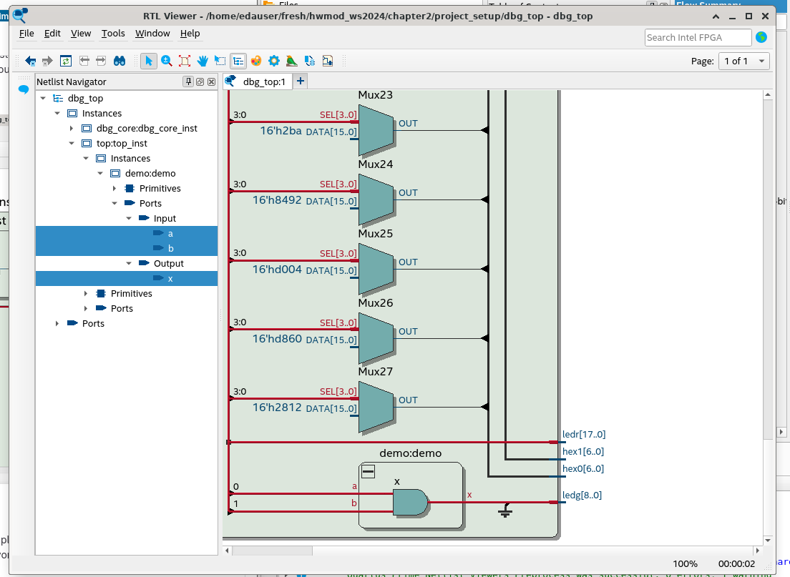
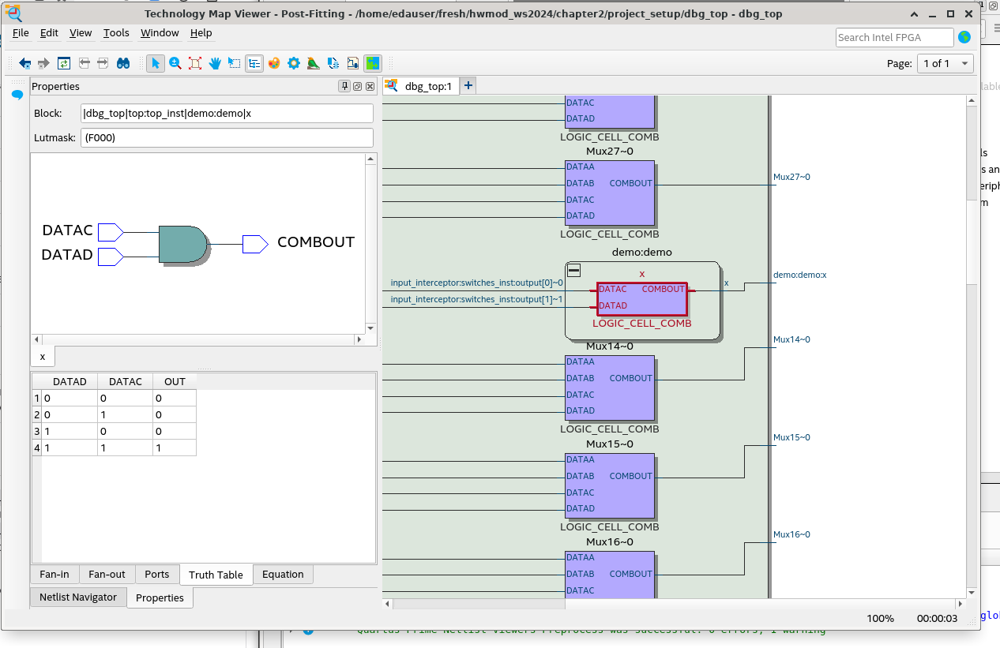

[Back](../../)
# Project Setup - Quartus
Introduction to the Quartus workflow. So now the VHDL code gets not only simulated with tools like Modelsim/GHDL but real synthesized (generates hw) this is done with the tool: Quartus.

## Start Quartus
The option --64bit is used so that quartus runs in the 64bit version. The & at the end is used so that quartus runs starts in the background. (usefull when working with the terminal because the terminal can then later still be used for other stuff.)
```
quartus --64bit &
```
### Command line
#### Compile
Compile the project and creating the bistrem file: q=quartus, so the command is
```
make qcompile
```
#### Demo Design in Netlist Viewer
The design can now be viewed in the netlist viewer. As seen there is the implemented AND-Gate. The Inputs a,b are connected to the switches on the
FPGA board and the output x is connected to a green led (ledg, g=green)

##### Technoogy Map Viewer (Pos-Fitting)

#### Connect to Lab
```
make qdownload
```
or
```
rpa_shell
```
Access video stream:
```
rpa_shell -s target
```
#### In the Lab-Environment
Controll Inputs and see FPGA Outputs with:
```
remote.py -i
```
