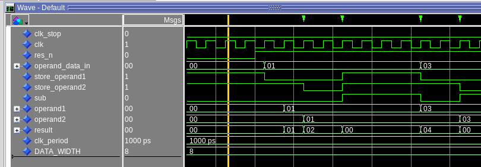
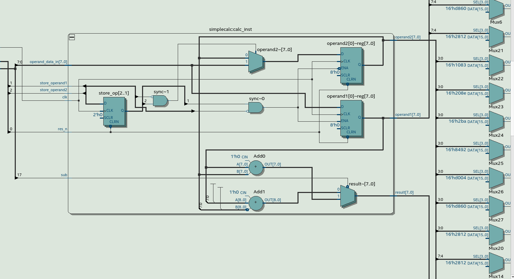

[Back](../../)
# Simple Calc
Creating a simple calculator that can add and subtract two numbers. Using two registers to store inputs from one data input. After storing some data in the registers using store_operand1 and store_operand2, the calculator outputs the result so the sum of the two registers. (this is combinational logic so it will continues output the sum). If sub is '1' the design outputs the subtraction of the registers.
## Simulation
The signals operand_data_in operand1, operand2, result are all in hex to make it easier to spot the value. The foure operations are marked with the green symbol on top.

## Test
This is the final design synthesiced in quartus. Using the rtl view there can be spotted the ff that were used. There are in total three flip flops used: One to store operand1 and one to store operand2 but there is also a third one to store the bits store_operand1 and store_operand2 this is used to detect the falling_edge of the high active input buttons.

