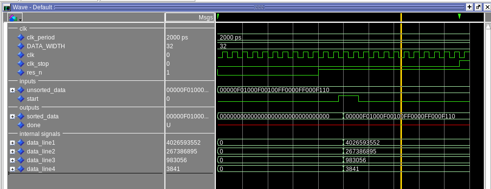
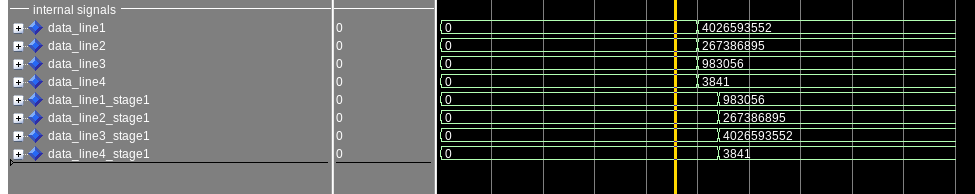
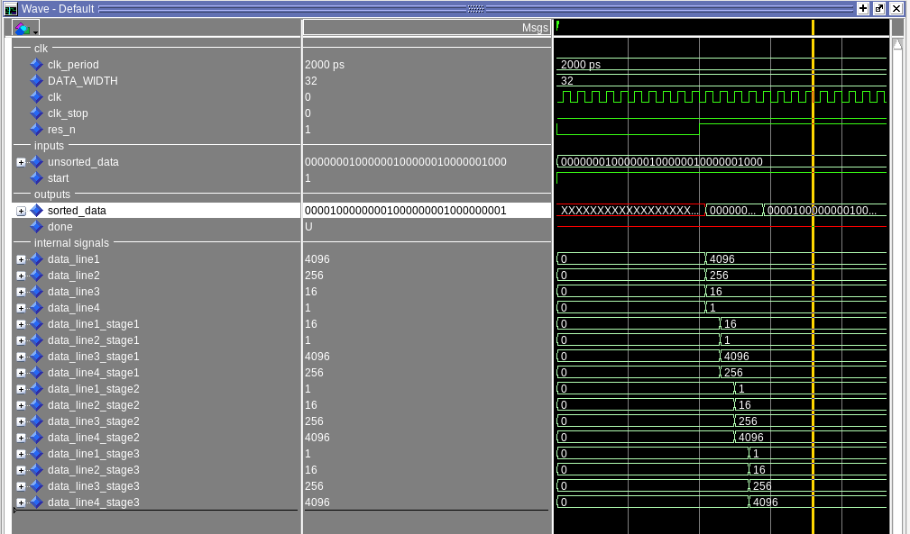
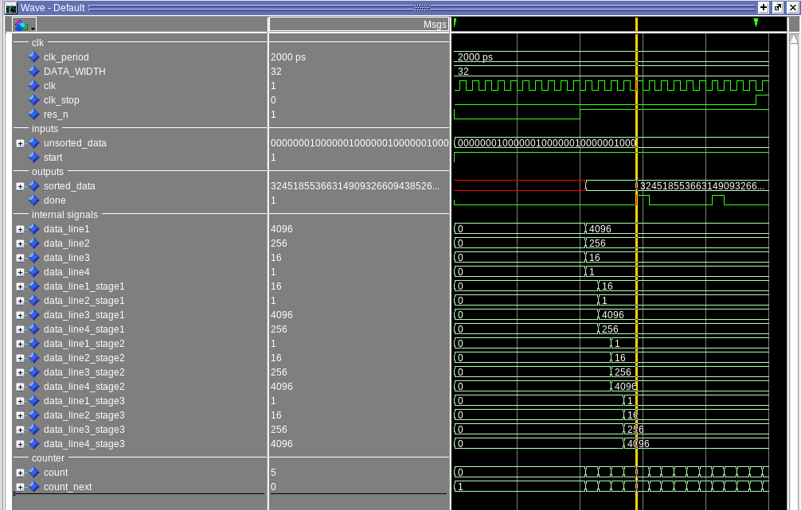
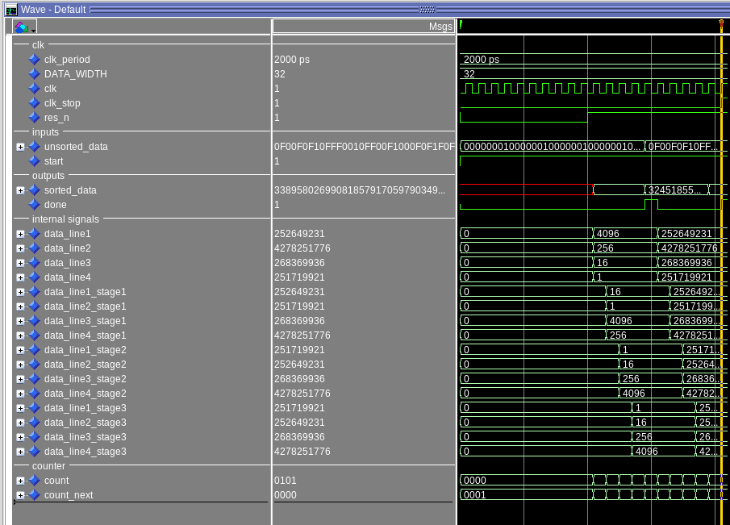
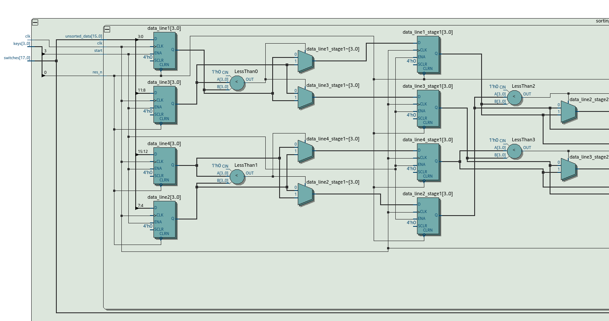
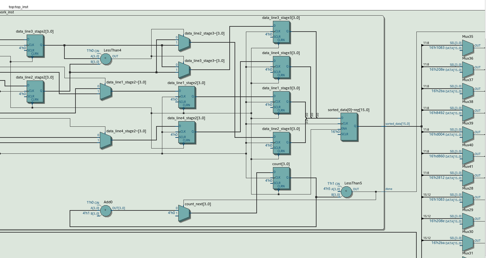

[Back](../../)
# Sorting Network
Sorting by using a pipeline like structure that compares two lines and swaps if the upper lines values is bigger than the lower line. Implemented using 4 lines and the structure [Sorting network for 4 inputs, 5 CEs, 3 layers](https://bertdobbelaere.github.io/sorting_networks.html), (4inputs=4lines, laysers=stages)
## Implementation and Simulation
Write boilerplate code for the tb (uut, basic stimulus, clk_gen) and sync process with just dummy values for the implementation. The split the line input into 4 lines using the generic DATA WIDTH.

 
After that create stage1 and simulate the behavior.
 

 
Then just add all stages and output the values from theline to the sorted output.
 

 
The last step was creating a counter to count the cc until the pipeline is done. Because the actual clk on the fpga board is real fast I use >=5 cc instead of the =5, makes the design less error prone.
 

 
After that the simulate can be easy done with the wait until done is equal to 1. So I simulated more data inputs.
 

## Test on the fpga Board
After the simulation is done with no spottet bugs anymore, it is time to test my design on the fpga board. I checked the design with the rtl viewer to see if my assumptions are right. The inputs are sampled when the start signal is on.

 
The outputs are visible and also the counter implementation using a register and an adder.

 
After that just make qdownload_remote and testing on the fpga board using remote.py -i.
