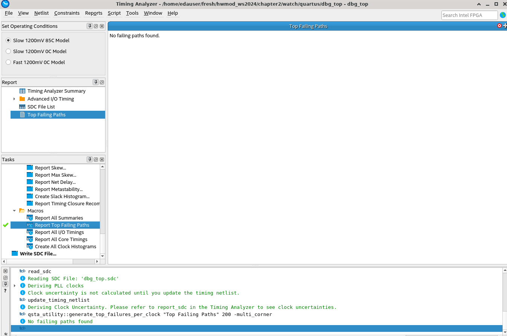

# Watch
Implementing a watch (either a stopwatch or a timer) and a bin2dec module.
## Stopwatch Module
Implementation of a stopwatch. A stopwatch has two input buttons start and stop. The stopwatch should also only count to the max displayed value and then stop at that value.
```
Init:
start = start the watch
stop = stop the watch

When the watch is stopped:
start = continues the watch from previous value
stop = reset the time to 0
```
Output are the seconds the stopwatch counted. The stopwatch need the clk_period and the digits that are available.
```
Digit = 1 then it counts from 0 to 9
Digit = 2 then it counts from 00 to 99
and so on...
```
The clk_period is needed to calculate the clk_frequency so how many cc are needed to count to one second. The conversion to an integer is needed to easy count and compare to the counter value.
```
Example with system clk of the fpga board:
T = CLK_PERIOD = 20 ns [Time]
f = CLK_FREQUENCY = integer(1 sec / CLK_PERIOD) = 50_000_000 =  50 MHz [Hz]

Example with pll clk that is 20 MHz
T = CLK_PERIOD = 50 ns [Time]
f = CLK_FREQUENCY = integer(1 sec / CLK_PERIOD) = 20_000_000 =  20 MHz [Hz]
```
### Implementation and Simulation
Write boilerplate code for the tb (uut, basic stimulus, clk_gen) and sync process. Then simulate the btn inputs. So just press start and stop. To simulate the behavior of async input the time of the button press is not fixed in the simulation. To check if they behave the same as on real hw on the fpga board. Debouncers are not implemented because the inputs on the fpga board are debounced.

<br>
To count up creat a counter that counts up when the btn start is pressed and stopps when the btn stop is pressed. The stopwatch should also be resetted when the stop button is pressed again and continued when the start button is pressed after the stopwatch is stoped.
<br>

<br>
The stopwatch should also stop counting when it reaches the max digit, so no overflow just stop counting at this point.
<br>

<br>

## Bin2Dec Module
Converts a binary number into a decimal number. As in chapter1 this can easy be done with a loop, but this approach is not possible in real hw.
```
In Simulation from chapter1: bin2dec:
for i in bin_in'range loop
  if bin_in(i) = '1' then
    int_local := int_local + 2**(i);
  end if;
end loop;
dec_out <= int_local;
```
HW approach so code that can also be synthesized and used on the fpga board not only simulated. <br>
Divide the given binary number by 10 and use mod 10 to get the last digit.
```
So in hw on every cc the input shuld be processed:
bin_in / 10 = next_bin_input
bin_in mod 10 = digit
```
Example with input 123.
```
Input is: (123)_10

first CC:
123 / 10 = 12
123 mod 10 = 3

second CC:
12 / 10 = 1
12 mod 10 = 2

third CC: then the process should repeat from the start
1 / 10 = 0
1 mod 10 = 1
```
The decimal output is an array of 4 bit unsigned values and is as big as the generic SSD_DIGITS is set.
The subtype dec_digits_t is used. (defined in the bin2dec_pkg)
```
decimal : dec_digits_t(SSD_DIGITS-1 downto 0)

1 digit is saved as an 4 bit unsigned called dec_digit_t
dec_digits is unsigned(3 downto 0)

The whole output is an array of dec_digits called dec_digits_t
dec_digits_t is array(integer range <>) of dec_digit_t


so (123)_10 is 
array(0) = 0011 = 3
array(1) = 0010 = 2
array(2) = 0001 = 1
```
### Implementation and Simulation
So instead of using a loop the implementation instead uses a sync process to process the binary input
on every cc. Start easy by implementing the design with fixed input of SSD_DIGIT = 1, so just one digit. There was just one cc needed to compute the whole input.
<br>

<br>
Next add an counter to output the right position in the decimals output array.
<br>

<br>
Try to convert bigger inputs like "123" using 3 digits
<br>

<br>
Problems with the decimal output and error when using a smaller number than the digits, because of wrong conditions in my code. The counter just countet until the digit was met. That worked fine until the input was lower than the max digit count. So "12" was converted into "121". Fixed it by reworking the code and condition. This was much harder than I thought it would be ...
<br>

<br>

## Test on the fpga Board
After the simulation is done with no spottet bugs anymore, it is time to test the design on the fpga board. But here are more than just one moduel so I just connected one module by one and tested it first seperately to spot bugs in the modules themself.
### Just init and connect the stopwatch module
Bug fixing (latches) in module stopwatch. The error was the ctn_nxt the signal got no a value in all paths. Fixing it by setting a default value in the beginning of the comb process. This fixed the latch bug and after that quartus did not yield any errors so next up the bin2dec module.
### Just init and connect the bin2dec module
Bug fixing (latches) in module bin2dec. The error was the decimal out got set to all '0' in the first iteration. But after that the implementation just sets 1 cell in the decimal array so all the other values are latches. Fixed it by using a internal signal decimal_internal and decimal_nxt. This fixed the latch bug. Then run again the full testbench and look if the simulation is still working.
<br>

<br>
## Critical Path Fail with system clk
After all the bugs in module stopwatch and bin2dec got solved the next step was a full compilation in quartus.
The program yields an cirtical path error because the system clk is to fast, as expected from the exercise description.
### Using pll clk
Timinganalyzer of the biggest cirtical path that fails:
<br>

<br>
Netlistviewer of the biggest cirtical path that fails:
<br>

<br>
Now using the provided pll clk_20 the critical path problem got solved.
<br>

<br>
After that make qdownload_remote and testing on the fpga board using remote.py -i.
```
User input config:

button0 = reset
button1 = start_count
button2 = stop_count
```
The design works as intended. The module bin2dec is used to represent the output of stopwatch in the hex outputs as seen in the screenshot.

