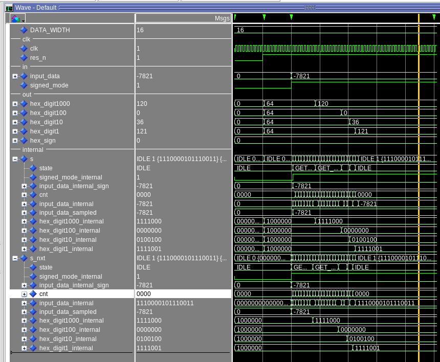

# BCD_FSM
Implementing a fms that displays a input number on a 4 digit seven segment display (ssd).
<br > <br >
Modules Inputs/Outputs
```
in:
		clk         system clk
		res_n       low active reset
		input_data  16 bit unsigned or signed data to display
		signed_mode select if signed or not signed data input

out:
		hex_digit1
		hex_digit10
		hex_digit100
		hex_digit1000
      digits to diplay the input_data on a seven segment display (ssd)

		hex_sign
      hex sign only active for signed_mode else just off
```

## Implementation and Simulation
For the start just implement a easier design: a fsm that just accepts unsigned inputs.
Overview of the basic idea for the conversion process.
```
--CONVERSION-PROCESS:

--Unsigned 16 Bit input so 0 to 2^16-1
-- if the input is = 0 just output 0
--(INPUT_NUMBER - 1000),  1k_cnt++,   until INPUT_NUMBER <= 1000
--(INPUT_NUMBER - 100),   100_cnt++,  until INPUT_NUMBER <= 100
--(INPUT_NUMBER - 10),    10_cnt++,   until INPUT_NUMBER <= 10
--(INPUT_NUMBER - 1),     1_cnt++,    until INPUT_NUMBER <= 0

--Signed 16 Bit input so -2^15 to 2^15-1
-- if the input is = 0 just output 0
-- if the input is > 0 just interpret the input as unsigned and use same logic as the unsigned case
-- if the input is < 0 use the abs(input) so - signed(input) then same logic as the unsigned case
```
### Implementing Design
#### Simulation
Write boilerplate code for the tb (uut, basic stimulus, clk_gen) and sync process. Start with a fsm with just two states: IDLE and START. The START state starts the conversion process, so the first step is to check what can trigger the transition from IDLE to START. A change in input_data or a change in the input signed_mode trigger that process. So I just simulate that and check if my transitions really trigger.
<br>

<br>
After that the START state is renamed to GET_DIGIT_1000 and a new state is added GET_DIGIT_100. To get the respected digits a counter is added. Now in every cc the inserted number gets subtracted and the counter counts up. Until the next transition gets triggerd. Here the transition is just subtract and count up until the input number is smaller than 1000. This was also an error I detected later in the testcase. This is a typical one off error because I use smaller than 1000 so in the case the input is exact 1000 it jumps in the next state instead of subtacting 1000 causing a wrong ouput.
<br>

<br>
To get the next digits, I just repeat this process in the states GET_DIGIT_10 and GET_DIGIT_100, until the whole number is converted. The output is done when the fsm is again in the IDLE state. But now here is the next error: The fsm always restarts because the input always changes after the conversation process. To solve this issue the input got sampled in the idle state and only when this sampled input changes the conversion process is started again. This is not important to do with the signed_mode input because this input just got sampled and not changed by the conversion process, so it can easy be checked again in the IDLE state. Also it is still important to also sample that input in a register to spot a change from '0' to '1' and also from '1' to '0' this is not possible withouth a register. (I know)
<br>

<br>
Output logic problem, bigger numbers are all converted correct, but the smaller numbers like 1900 or 0013 so all numbers with 0 got error. That problem got solved by also checking the condition if the whole input is 0 and also by checking in every state if the number is 0 before the first conversion is done and giving the right output to the hex output.
<br>

<br>
This fixed now the error
<br>

<br>
So now as final step the real hex value got inserted to the hex outputs using the ssd library. I only did this change at this point because it was just easier to check the outputs if they just yield a unsigned number instead of the hex outputs. But now also the testcases get automated by using assertions.
<br>

<br>
Now the first implementation is done and is checked in quartus. No latches detected and the
design looks solid. The conversion process to also convert signed inputs gets now added. The first step is to spot the right transitions and to get the right values. The same logic can be used for positive numbers so this can be easy done with the same states as for the unsigned input case. The problem is the negative values. To also convert negative value, I just convert the number into a positive number with the same value and save the sign. Also the implementation is rewritten using the record type with all registers, so only the signal s and s_nxt are used.
<br>

<br>
The output of the testcases for unsigned and signed inputs can be seen in the file
```
cat exhaustive_test_output.txt
  0 tb/bcd_fsm_tb.vhd:195:5:@0ms:(report note): sim start


  1 tb/bcd_fsm_tb.vhd:111:9:@40ns:(report note): start testing unsigned input values
  2 tb/bcd_fsm_tb.vhd:116:9:@40ns:(report note): test with input = 0
  3 tb/bcd_fsm_tb.vhd:116:9:@240ns:(report note): test with input = 1
  4 tb/bcd_fsm_tb.vhd:116:9:@440ns:(report note): test with input = 2
  5 tb/bcd_fsm_tb.vhd:116:9:@640ns:(report note): test with input = 3
  6 tb/bcd_fsm_tb.vhd:116:9:@840ns:(report note): test with input = 4
  7 tb/bcd_fsm_tb.vhd:116:9:@1040ns:(report note): test with input = 5
  8 tb/bcd_fsm_tb.vhd:116:9:@1240ns:(report note): test with input = 6
  9 tb/bcd_fsm_tb.vhd:116:9:@1440ns:(report note): test with input = 7
...
 10 tb/bcd_fsm_tb.vhd:116:9:@1999440ns:(report note): test with input = 9997
  9 tb/bcd_fsm_tb.vhd:116:9:@1999640ns:(report note): test with input = 9998
  8 tb/bcd_fsm_tb.vhd:116:9:@1999840ns:(report note): test with input = 9999
  7 tb/bcd_fsm_tb.vhd:122:7:@2000040ns:(report note): test with input = 10000
  6 tb/bcd_fsm_tb.vhd:125:7:@2000240ns:(report note): test with input = 19191
  5 tb/bcd_fsm_tb.vhd:128:7:@2000440ns:(report note): done testing unsigned input values


  4 tb/bcd_fsm_tb.vhd:175:9:@2000440ns:(report note): start testing signed input values:
  3 tb/bcd_fsm_tb.vhd:180:9:@2000440ns:(report note): test with input = 0
  2 tb/bcd_fsm_tb.vhd:180:9:@2000540ns:(report note): test with input = 1
  1 tb/bcd_fsm_tb.vhd:180:9:@2000640ns:(report note): test with input = 2
  0 tb/bcd_fsm_tb.vhd:180:9:@2000740ns:(report note): test with input = 3
...
  5 tb/bcd_fsm_tb.vhd:180:9:@2999940ns:(report note): test with input = 9995
  4 tb/bcd_fsm_tb.vhd:180:9:@3000040ns:(report note): test with input = 9996
  3 tb/bcd_fsm_tb.vhd:180:9:@3000140ns:(report note): test with input = 9997
  2 tb/bcd_fsm_tb.vhd:180:9:@3000240ns:(report note): test with input = 9998
  1 tb/bcd_fsm_tb.vhd:180:9:@3000340ns:(report note): test with input = 9999
  0 tb/bcd_fsm_tb.vhd:187:9:@3000440ns:(report note): test with input = -9999
  1 tb/bcd_fsm_tb.vhd:187:9:@3000540ns:(report note): test with input = -9998
  2 tb/bcd_fsm_tb.vhd:187:9:@3000640ns:(report note): test with input = -9997
  3 tb/bcd_fsm_tb.vhd:187:9:@3000740ns:(report note): test with input = -9996
  4 tb/bcd_fsm_tb.vhd:187:9:@3000840ns:(report note): test with input = -9995
...
  6 tb/bcd_fsm_tb.vhd:187:9:@3999840ns:(report note): test with input = -5
  5 tb/bcd_fsm_tb.vhd:187:9:@3999940ns:(report note): test with input = -4
  4 tb/bcd_fsm_tb.vhd:187:9:@4000040ns:(report note): test with input = -3
  3 tb/bcd_fsm_tb.vhd:187:9:@4000140ns:(report note): test with input = -2
  2 tb/bcd_fsm_tb.vhd:187:9:@4000240ns:(report note): test with input = -1
  1 tb/bcd_fsm_tb.vhd:187:9:@4000340ns:(report note): test with input = 0
  0 tb/bcd_fsm_tb.vhd:191:9:@4000440ns:(report note): done testing signed input values


  1 tb/bcd_fsm_tb.vhd:206:5:@4000440ns:(report note): done sim

```

### Test on the fpga board
Now the design is tested using quartus. It is now syntehsized and downloaded to the fpga board.
<br> <br>
Module view
<br>

<br>
Highlighting the inputs
<br>

<br>
Highlighting the outputs. The outputs only rely only on the current state and not on the inputs, so this a implmentation of a moore fsm.
<br>

<br>
Quartus has correctly synthesized my implmentation as state machine with the only valid values for states (IDLE, GET_DIGIT1 and so on...). Because the state is of typ enum.
<br>

<br>
