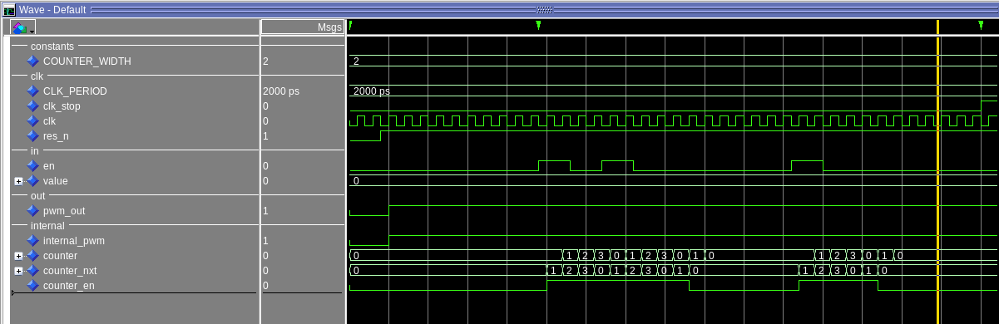
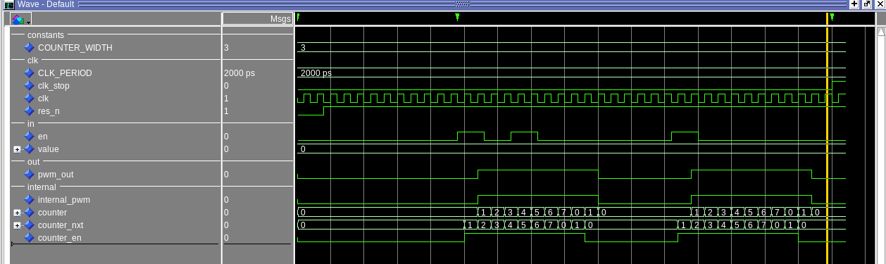
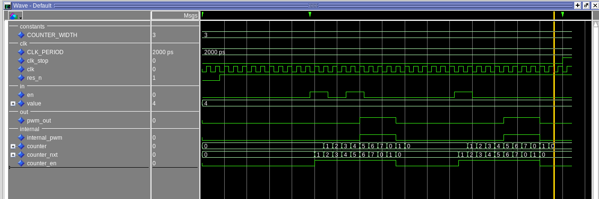
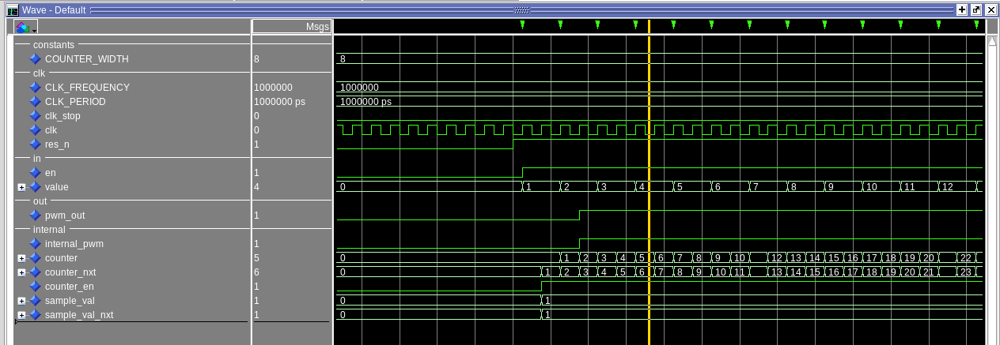
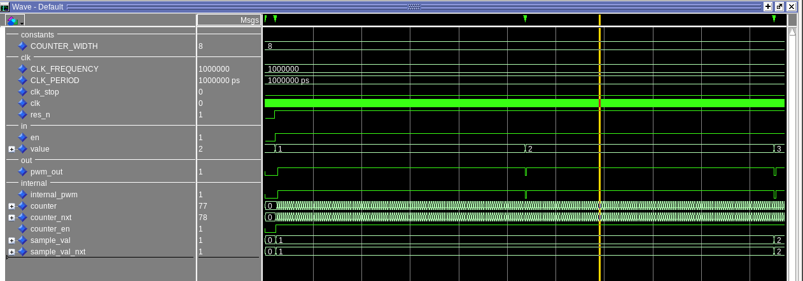
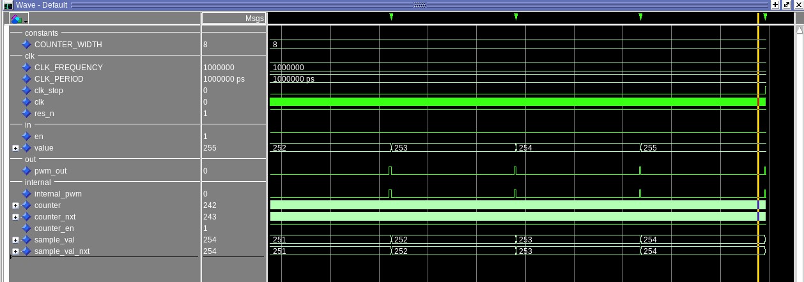
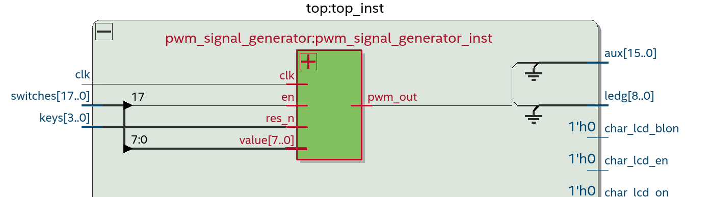
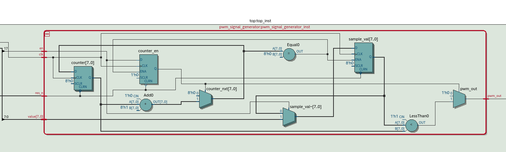

# Pulse Width Modulation (PWM)
Implementing a pwm signal generator. [Wiki](https://en.wikipedia.org/wiki/Pulse-width_modulation)
<br > <br >
Modules Inputs/Outputs
```
in:
  clk        std_ulogic = system clk
  res_n      std_ulogic = reset signal

  en         std_ulogic = enables
    starts the signal generation
    so also starts the internal counter

  value      std_ulogic_vector(COUNTER_WIDTH-1 downto 0)
    value that controlls the duty_cycle (how long pwm_out will be set to 1)

out:
  pwm_out   std_ulogic = output signal that is generated
    pwm_out = 0 when value < internal_counter
    pwm_out = 1 when value >= internal_counter

```
## Implementation and Simulation
The module gets now simulated in two ways. I create a simple basic test suit to check and implement the counter and enable signal. Also create some basic small testcases to see if the design works correct for that inputs. After that a more sophisticated simulation is created to all values for a width = 8 value so 0 to 2^8-1 = 255. The pwm timing is checked using the function now to check the timing constrains and also assertions to automatically detect if there is something wrong.
### Basic Simulation
Write boilerplate code for the tb (uut, basic stimulus, clk_gen) and sync process. Check the enable signal. It should not matter if the enable is changed if a active cycle is generated. The pwm_out is just set to 1 for the whole period. Also the basic counter is implemented.
<br>

<br>
Now the pwm_out is implemented and a full full duty cycle is simulated. (value=max_value="111") for a COUNTER_WIDTH of 3
<br>

<br>
Simulate a half duty cycle, so value is changed to the max_value/2.
<br>

<br>
The value input could change through a generated period, so instead of used to compare the output it gets sampled at the start. So the sampled value gets used to generated the correct pwd_out signal.
<br>

<br>

### More Sophisticated Simulation
Now the Width is set to 8, the clk frequency is set to 1 MHz. The value is looped from 0 to 255. The simulation just starts and then waits until the pwm_out out has a falling_edge, then the next value is applyed and so the next period is generated. This is done for all values.
<br>

<br>
Here can be seen the last test values so the pwd_out pulse gets smaller and smaller when the input value gets bigger.
<br>

<br>
To automatically check the timing timestamps are set at the start of the period, then the toggle of the pwd_out and the end time point.
<br>

<br>
This three timestamps can be used to calculated the time period
```
procedure check_pwm_signal(expected_low_time, expected_high_time: time) is
  variable start_time : time;
  variable low_time : time;  --time from pwm_out is '0' until pwm_out is '1'
  variable high_time : time; --time pwm_out is '1' until '0' again (overflow = end of the period)
```
Then the expected time is compared with the time needed in the simulation using assertions
```
assert low_time = expected_low_time  report "Low time mismatch! "
  & "low time is = " & to_string(low_time)
  & "expected low time is = " & to_string(expected_low_time)
  severity error;

assert high_time = expected_high_time report "High time mismatch!"
  & "high time is = " & to_string(high_time)
  & "expected high time is = " & to_string(expected_high_time)
  severity error;
```

### Test on the fpga board
First layer of the design in the rtl view.
<br>

<br>
Here now can be seen that quartus uses the right ram blocks of the fpga board "syncram_block"
<br>

<br>
Now loading the design on the fpga board and testing it. The reset is on key0, enable is on switch 17 and there is an 8 bit input value from the switches. Finally the output is set to the green led0 (ledg0).
```
--in
  res_n   => keys(0)
  en      => switches(17)
  value   => switches(7 downto 0)

--out
  pwm_out => ledg(0)
```
