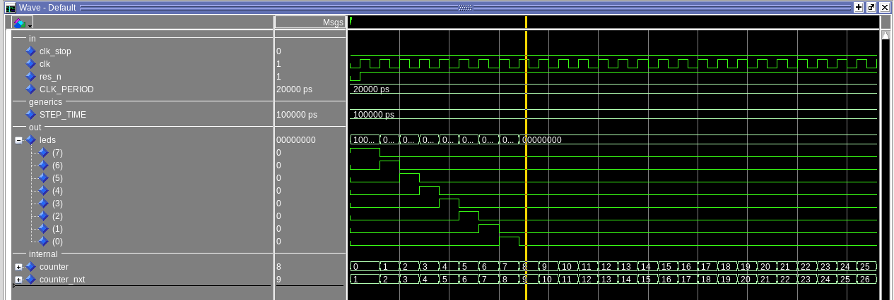
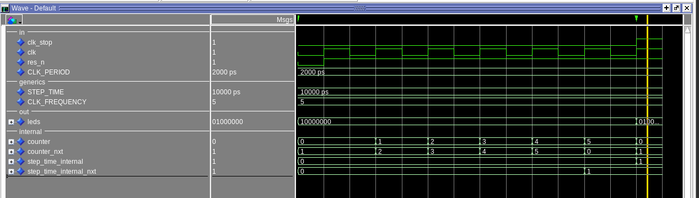
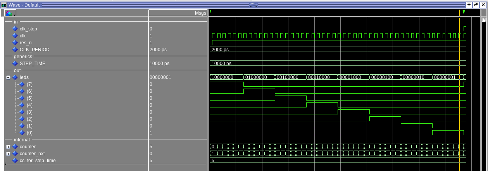
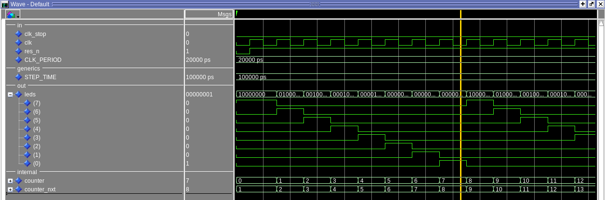
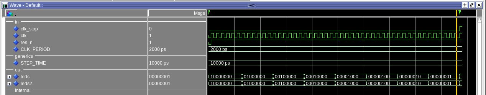
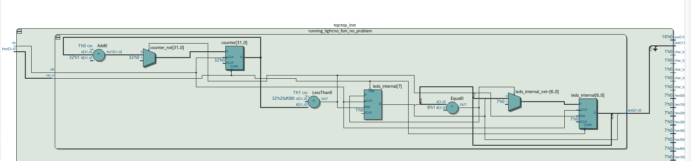
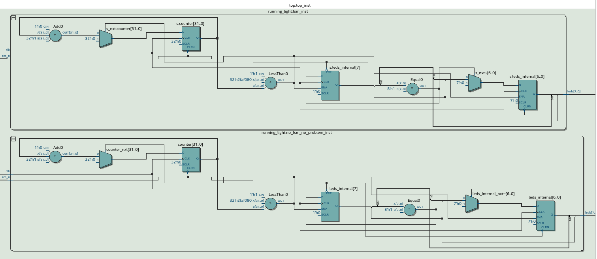

# Running Leds (Lights)
Implementing a repeating output pattern. The output pattern is:
````
"1000_0000"
"0100_0000"
"0010_0000"
"0001_0000"
"0000_1000"
"0000_0100"
"0000_0010"
"0000_0001"
here it repeats from the start again
"1000_0000"
"0100_0000"
"0010_0000"
"0001_0000"
"0000_1000"
"0000_0100"
"0000_0010"
"0000_0001"
and so on....
````
<br > <br >
Modules Inputs/Outputs
```
generic:
	STEP_TIME  : time := 1 sec;
    time to switch to the next pattern
    (1000 -> wait for step_time -> 0100 -> wait for step_time -> 0010 ...)

  CLK_PERIOD: time := 20 ns
    period of the system clk, 50 MHz => 20 ns

in:
  clk        std_ulogic = system clk
  res_n      std_ulogic = reset signal

out:
  leds std_ulogic(7 downto 0);
    output pattern always 8 bit
```

## First Implementation and Simulation
### Implementing Design with sync, comb logic (No FSM)
#### Simulation
Write boilerplate code for the tb (uut, basic stimulus, clk_gen) and sync process. Add a simple counter and a constant output value for the leds. Also just output a new pattern on every clk edge.
<br>

<br>
Now use the frequency and also the step_time to output the pattern.
<br>

<br>
Instead of using the freuqency as integer, I just use the time_step directly as time type and so I need the clk_period. It is much easier to simulate it with different inputs so I also added the clk_period as generic to the module.
<br>

<br>
Add the generic clk period input to make the design more generic and to make it also easier to simulate it with different period values.
<br>

<br>
I just started with the intention to use a FSM as soon as I need one but there was just no need because the pattern could be easy calculated with just registers and so this would be equaly as a FSM with just one state, but for science I'm going to implement it now with the use of FSM style and compare the generated hardware.

### Implementing Design as FSM
Now the same design will be implemented using a fsm.
Using the first design as start position and rewrite it to use the fsm design pattern. There is only one state, so I decide to just omit the output and input logic that checkes the s.state signal because there is no need to check the state if there is only one possible state.
```
leds1 <= output of first implementation
leds2 <= output of fsm implementation
```
This simulation compares the output of the first and the second implementation.
<br>

<br>

## Test on the fpga board
Now the design is tested using quartus. It is now syntehsized and downloaded to the fpga board. First the first implmentation using no fsm.
<br>

<br>
Now comparing the first implementation with the fsm implementation. The generated hardware is in that case the same, just different names but the components that are used are the exact same.
```
  STEP_TIME  : time := 1 sec;
  CLK_PERIOD: time := 20 ns; -- fpga board system clk frequency is = 50 MHz

no fsm implementation:
  in
      res_n = keys(0),
  out
      leds = ledr(7 downto 0)

fsm implementation:
  in
      res_n = keys(0),

  out
      leds => ledr(15 downto 8)
```
Both implementations use the same inputs key0 for the reset. The output of the first unit is on the red leds ledr(7 downto 0) and the output of the second unit the fsm implementation uses the upper red leds so ledr(15 downto 8)
<br>

<br>
